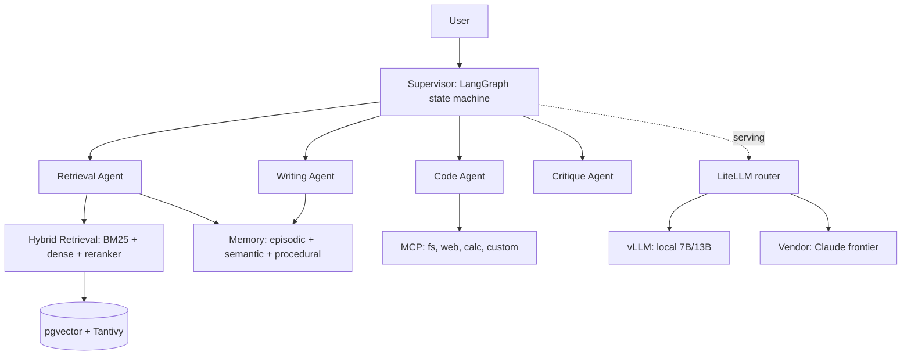

# Exercise 1 — The architecture diagram and component table

**Time estimate:** ~45 minutes. Guided.

## Goal

Draw the capstone's architecture as a Mermaid diagram at the right level of detail, and write the component/interface table that the diagram annotates. By the end you'll have the first artifact of the architecture document — the diagram and the component map — and you'll have *tested* your understanding of the system by trying to draw it (the gaps in your understanding show up as boxes you can't connect).

## Prerequisites

- The capstone spec (resources.md / SYLLABUS.md) re-read with Sprint A in mind.
- A Markdown previewer that renders Mermaid (most do — VS Code with a Mermaid extension, GitHub, the Mermaid live editor).

## Steps

### 1. Draw the component diagram

Write `architecture.md` with a Mermaid `flowchart` showing the capstone's components and their connections. Start from the syllabus default (supervisor over four agents, hybrid retrieval, MCP, three memory tiers, vLLM + vendor serving) and adapt to your corpus/domain:



The level-of-detail test (Lecture 1 §3b): **could a new engineer read your diagram and know which box to look in for a given bug?** "Retrieval is bad" → the Hybrid box. "Agent forgot the user's name" → the Memory box. If yes, it's the right level. Not a single "system" box; not a call graph.

### 2. Write the component/interface table

Below the diagram, write a table: one row per component, with its responsibility and its interface (the contract other components call it through):

```
| Component   | Responsibility                          | Interface |
|-------------|------------------------------------------|-----------|
| Supervisor  | orchestrate; delegate; synthesize        | run(query) -> answer |
| Retrieval   | hybrid retrieval over the corpus         | retrieve(query, k, filters) -> [Chunk] |
| Memory      | episodic/semantic/procedural state       | read_*/write_* per tier |
| ...         | ...                                      | ... |
```

The *interface* column is the load-bearing one — it's the contracts that decouple the components. If you can't write a clean interface for a component, that's a design gap to resolve *now*.

### 3. Trace one query through the diagram

Write a short data-flow trace (Lecture 1 §6b): a concrete query, and its journey through the boxes (supervisor → retrieval agent → `retrieve()` → memory → writing agent → answer). Writing the trace tests every interface — if the trace needs something an interface doesn't provide, you found a gap.

### 4. List the decisions and risks

Add a short decisions section (3–4 ADR-style entries: store, chunker, serving — what you chose, rejected, why) and a risks section (2–3 honest risks: ingest time, index recovery, a memory edge case). These are the spine of the eventual 6-page document.

## Acceptance criteria

- [ ] `architecture.md` has a Mermaid diagram at the right level (components + edges; passes the new-engineer-bug test).
- [ ] A component/interface table with the *interface* (contract) for each component.
- [ ] A one-query data-flow trace through the diagram.
- [ ] A decisions section (≥3 ADR-style entries) and a risks section (≥2 risks).
- [ ] The diagram matches the system you intend to build (it's a plan, kept honest later).

## Hint

If you can't draw an edge — "how does the writing agent get the retrieved chunks?" — that's not a diagram problem, it's a missing interface. Resolve it by defining the interface (the writing agent receives chunks via the supervisor's context object), then draw the edge. The diagram exposing a missing connection is the diagram doing its job — that's *why* you draw it before coding.

## Why this matters

The capstone requires a Mermaid diagram "kept in sync with reality" and a 6-page architecture document. This exercise is the seed of both — the diagram and the component map that the document is built around. And drawing it now, before the code, surfaces the interface gaps while they're cheap to fix (on paper) instead of expensive (mid-Sprint-B). The diagram is the cheapest design review you'll do all capstone.
