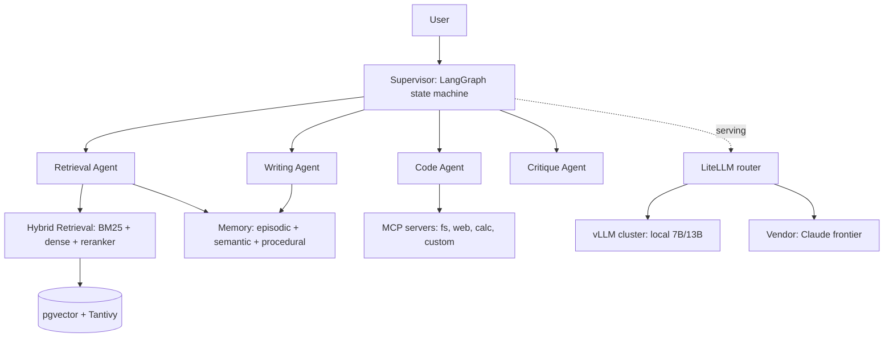

# Lecture 1 — The Architecture Document and Corpus Ingestion: Write the Document First

> **Duration:** ~2 hours of reading + hands-on.
> **Outcome:** You can write a 6-page architecture document for the capstone — components, interfaces, data flow, decisions-and-alternatives, build sequence — and keep a Mermaid diagram in sync with it; ingest a 10 GB private corpus through the extraction → clean → chunk → embed → store pipeline at a scale where the operational story matters; and land hybrid retrieval (BM25 + dense + reranker, RRF) behind a single clean `retrieve()` interface, measured on a gold set.

If you remember one sentence from this entire week, remember this one:

> **A capstone is an architecture document with code attached. Write the document first.**

This is the week the course's recurring lessons converge. Measurement (every week): the retrieval substrate is measured on a gold set, the memory tiers on a regression test. Interfaces (weeks 5, 13): the agents call clean contracts, not implementations. Operations (weeks 10, 19): the 10 GB ingest is a measured, recoverable operation. Cost (week 21): the serving and memory layers are budgeted. The capstone isn't a new topic — it's the *integration* of everything, which is exactly why it's hard and exactly why the document comes first.

There's a corollary you should tape next to it:

> **Sprint A is the foundation, not the demo. Get the retrieval and memory *interfaces* right and the rest clicks on; get them wrong and you re-architect under deadline.** The interfaces you commit to this week are contracts every later component honors. Design them to be stable.

For twenty-one weeks you built isolated pieces. The capstone is the week the pieces become a *system*, and a system is defined by its *interfaces and data flow*, not by its components in isolation. The architecture document is where you make those interfaces explicit *before* the code forces them to be implicit and wrong. This lecture is half "how to write the document" and half "how to build the corpus-and-retrieval foundation the document specifies."

A word on posture, because the capstone is a different kind of work than the weekly labs. The weekly labs were *learning* exercises — build a chunker, measure a threshold, run a benchmark. The capstone is a *delivery* exercise: you're shipping a system a sealed-review panel will grade, and the grading is on whether it *works as a system* (correctness), whether it's *engineered well* (structure, error handling), whether it's *measured* (Ragas, cost, latency numbers), and whether it's *written up* (the architecture doc, the postmortem). Sprint A sets the trajectory on all four axes: a clean foundation with good interfaces, measured retrieval, and a clear document is a capstone on track; a pile of components with no interfaces and no document is a capstone that will thrash through Sprints B and C. The most important hour of the capstone is the one you spend on the architecture document in Sprint A, because it's the hour that makes the next forty hours assembly instead of improvisation.

---

## 1. Why the document comes first

The instinct, after twenty-one weeks of building, is to start coding the supervisor agent. Resist it, for three concrete reasons:

**The parts have hard dependencies.** The supervisor delegates to a retrieval agent, which calls `retrieve()`. The retrieval agent can't be built before `retrieve()`'s signature exists. The writing agent reads from memory; memory's read interface must exist first. If you build in the wrong order, you build against interfaces you'll have to change, and changing an interface means changing every caller. The document is where you *decide the interfaces* so the build order is dependency-correct: foundation (retrieval, memory) first, then the agents that call it, then the orchestration that sequences them.

**The decisions need to be made once, deliberately.** Which vector store? Which chunking strategy? How does an agent read semantic memory — by query, by entity, by both? These are decisions with consequences that ripple through the whole system. Made in the document, they're made once with reasons; made ad hoc in code, they're made five times inconsistently and you discover the inconsistency at integration time. The document forces the decision *and records the alternative you rejected*, so when someone (including future-you) asks "why pgvector not Qdrant?", the answer is written down.

**The document is a deliverable, graded.** The capstone requires a Mermaid architecture diagram "kept in sync with reality" and the Phase II milestone requires a 6-page architecture memo. These aren't busywork — they're how a sealed-review panel evaluates whether you *understand* your own system. A working demo with no document reads as "I got lucky"; a document with a matching system reads as "I designed this."

> **The discipline:** the document is not written *after* the system to describe it; it's written *before* the system to specify it, and kept in sync *as* the system is built. The Mermaid diagram in your README should always match the running code — when they diverge, one of them is a lie, and you fix it.

---

## 2. What goes in the 6-page architecture document

Six pages is a constraint, and a good one — it forces you to say what matters and cut what doesn't. The sections, roughly a page each:

**1. Context and goal (½ page).** What the system does in one paragraph (the capstone spec), who uses it, what "done" looks like. The one-paragraph spec from the syllabus, in your words, plus the corpus and the success criteria (the eight deliverables).

**2. Component overview (1 page).** The boxes: supervisor, retrieval/code/writing/critique agents, hybrid retrieval, MCP servers, the three memory tiers, the serving tier (vLLM + LiteLLM + vendor), the eval and tracing layers. One paragraph each — what it is, what it's responsible for. This is the Mermaid diagram, annotated.

**3. Interfaces and data flow (1½ pages).** The contracts. `retrieve(query) -> ranked_chunks`. `memory.read(tier, key) -> facts` / `memory.write(tier, fact)`. The supervisor's `delegate(subagent, task) -> result`. The sub-agent signatures. And the *flow*: a query enters at the supervisor, which delegates to the retrieval agent, which calls `retrieve()`, which consults memory, which... This is the most important section — it's where the system is actually defined. Vague interfaces here become re-architecture in week 23.

**4. Key decisions and rejected alternatives (1 page).** A handful of ADR-style entries: "We chose pgvector over Qdrant because we already operate Postgres and the 10 GB corpus fits comfortably in HNSW; we rejected Qdrant despite its faster filtered search because operating a second datastore isn't worth it at this scale." Each decision names what you chose, what you rejected, and *why* — the reasoning is the value.

**5. The build sequence (½ page).** What's done (Sprint A: retrieval + memory foundation), what's next (Sprint B: agents, MCP, serving, eval), what's deferred (chaos drill). With dependencies named, so the plan is realistic: "the supervisor (Sprint B) depends on the retrieval and memory interfaces (Sprint A, done)."

**6. Risks and open questions (½ page).** The honest section: what might not work, what you're unsure about, what you'd do with more time. "The 10 GB index rebuild takes ~40 minutes, which is a chaos-drill recovery-time risk." Naming the risks is a senior skill; pretending there are none is a junior tell.

> **Rule of thumb:** if your architecture document doesn't have a "rejected alternatives" section and a "risks" section, it's a description, not an architecture. The decisions and the honesty are what make it worth reading.

Six pages, not sixty — the constraint is the discipline. A 60-page architecture document is a sign of a system nobody understands well enough to summarize; a 6-page one forces you to identify the load-bearing decisions and cut the rest. If you can't explain your capstone's architecture in six pages, you don't yet understand which parts matter — and the act of compressing to six pages *is* the act of figuring that out. The career-pack portfolio (the syllabus's `portfolio.md`) wants this document as a showcase artifact, which is another reason to make it tight and well-reasoned: it's something you'll hand a recruiter. Write it for a smart reader who has fifteen minutes, not for a completeness checklist.

---

### 2b. A worked decisions section

The decisions section is the part most students under-write, so here's the shape of three real entries, ADR-style. Each is three sentences: the decision, the rejected alternative, the reason.

```
DECISION 1 — Vector store: pgvector
  Chosen: pgvector (Postgres + HNSW) for the dense retrieval and semantic memory.
  Rejected: Qdrant (faster filtered search) and Weaviate (generative search).
  Why: we already operate Postgres, the 10 GB / ~180K-vector corpus fits HNSW
  comfortably, and one datastore is a smaller 2-AM surface than two. Qdrant's
  filtered-search edge doesn't justify a second operational story at this scale.

DECISION 2 — Chunking: recursive @ 512 tokens, 64 overlap
  Chosen: the recursive chunker from the week-8 A/B (Recall@5 0.88 on the gold set).
  Rejected: fixed-512 (split ~6% of answers) and late-chunking-with-jina (needs a
  second embedding model, +2.5x embed time for +0.01 Recall@5).
  Why: recursive keeps each section intact on this corpus and beats fixed without a
  model swap; the late-chunking lift didn't justify a second embedder in the pipeline.

DECISION 3 — Serving: vLLM local tier + Claude frontier, LiteLLM-routed
  Chosen: Qwen2.5-7B on vLLM for easy queries, Claude Sonnet for hard, routed by a
  difficulty classifier (week 21), with a vendor fallback (week 19).
  Rejected: all-vendor (simpler, but ~9x more expensive above our volume) and
  all-local (cheaper, but the 7B's hard-question quality is below tolerance).
  Why: the hybrid hits our cost target (break-even at ~Nx our volume) while holding
  quality on the hard set; neither pure option does both.
```

Three entries, nine sentences, and a reviewer now knows *why* your system looks the way it does — and can challenge a decision on its stated reasoning rather than guessing at it. That's the entire value of the section: it turns "the system happens to use pgvector" into "we chose pgvector over Qdrant for these reasons, and here's the trade we accepted." A capstone doc without this section describes a system; with it, it *defends* one. Write 4–6 of these covering your load-bearing choices (store, chunker, serving, memory schema, fusion method) and the decisions section writes itself.

## 3. The Mermaid diagram as a living artifact

The capstone requires the diagram "in Mermaid, committed to the repo, kept in sync with reality." Mermaid is diagram-as-code — text that renders to a flowchart — which is *why* it can stay in sync: it lives in the repo, it diffs, and a PR that changes the architecture changes the diagram in the same commit.



That diagram *is* the component-overview section, and the discipline is that **it matches the code**. When you build the retrieval interface (Exercise 2), the `Hybrid` box's contents are real. When you wire memory (Exercise 3), the `Memory` box is real. When the diagram says "RRF fusion" and the code does plain concatenation, the diagram is lying — fix one or the other in the same commit. A diagram that drifts from the code is worse than no diagram: it actively misleads the reviewer (and future-you) about what the system does.

The capstone's default architecture (from the syllabus) is a fine starting point — supervisor over four agents, hybrid retrieval, MCP, three memory tiers, vLLM+vendor serving. You *can* vary it (the spec says "can vary"), but if you do, the document's decisions section must justify the variation. Most students start from the default and customize where their corpus or domain demands it.

---

### 3b. What the diagram should and shouldn't show

A common failure with the architecture diagram is detail level — either a single box labeled "the system" (useless) or a sprawling diagram with every function (unreadable). The right level shows **components and their connections**, at the granularity of "things that have an interface between them":

- **Show:** the supervisor, the four sub-agents, the retrieval substrate, the memory layer, the serving tier, the MCP servers, the stores. The edges between them (who calls whom).
- **Show:** the *direction* of data flow (user → supervisor → agents → retrieval/memory).
- **Don't show:** the internals of a component (the BM25-vs-dense-vs-reranker breakdown belongs in the retrieval substrate's own sub-diagram or the text, not the top-level diagram).
- **Don't show:** every function call, every helper, every config option. That's code, not architecture.

The test for the right level: **could a new engineer read the diagram and know which component to look in for a given bug?** "Retrieval is returning bad chunks" → the Retrieval/Hybrid boxes. "The agent forgot the user's name" → the Memory box. If the diagram routes a new engineer to the right component, it's at the right level. If it's so abstract that everything is "the system" or so detailed that it's a call graph, it fails that test. The capstone's default diagram (from the syllabus) is exactly this level — components and edges — and yours should match it in granularity even if it differs in content.

## 4. Corpus ingestion at scale: where the operational story gets real

Now the foundation itself. The capstone runs over a **10 GB private corpus**, and at that scale the ingest pipeline from week 8 — extraction → clean → chunk → metadata → embed → store — stops being a quick script and becomes an *operation* with throughput, time, and cost you must reason about.

The pipeline, scaled:

1. **Extraction** (week 8) — pull text from the source documents (PyMuPDF for native PDFs, Unstructured for mixed, OCR for scans). At 10 GB this is hours of CPU, and a failed extraction on document 8,000 of 10,000 should not restart from zero — **checkpoint the ingest** so it's resumable.
2. **Cleaning** — strip boilerplate, fix hyphenation, drop repeated headers/footers. Boilerplate that repeats on every page pollutes every chunk; at scale, one bad cleaning rule corrupts the whole index.
3. **Chunking** (week 8) — your *winning* chunker from the week-8 A/B (`chunkers.load(<your-winner>)`), measured in the embedding model's tokens. 10 GB → ~150K–200K chunks depending on chunk size; this number sizes everything downstream.
4. **Metadata** — attach `source_doc_id`, `section`, `page`, and any filter fields to each chunk. At scale, metadata is what lets you filter ("only docs from 2024") and cite ("doc X, page 12") — and it's load-bearing for the agents.
5. **Embedding** — BGE-large over ~180K chunks. This is the real compute cost; batch it, and consider running it on your week-19 vLLM/GPU if CPU embedding is too slow. Checkpoint here too.
6. **Store** — into pgvector (HNSW index) *and* Tantivy/ES (BM25). Building the HNSW index over 180K vectors takes real time; record it.

The numbers that matter, and that the architecture doc must report:

- **Ingest throughput** — how long does the full pipeline take? This is your "time to rebuild from scratch," which is a chaos-drill recovery number (week 24 corrupts the index; you restore it).
- **Index build time** — how long to build HNSW over the corpus? Separate from ingest, because a schema change rebuilds the index without re-extracting.
- **Index size on disk** — 180K vectors at 1024 dims (4 KB each) is ~720 MB of vectors plus the HNSW graph plus the BM25 index plus the original chunks. The disk budget is real.
- **Rebuild-after-schema-change cost** — if you change the chunk size or add a metadata field, you re-chunk and re-embed and re-index. This is the cost of getting the schema wrong, and it's why the chunking decision (week 8's A/B) should be *settled* before the 10 GB ingest, not after.

> **The operational discipline:** at 10 GB, ingest is checkpointed, resumable, and measured. "I ran the script and it worked" is a 50-page-corpus answer; "the ingest takes 2h10m, the HNSW build takes 18m, the index is 4.1 GB on disk, and a chunk-size change is a full 2h28m rebuild" is the capstone answer. These numbers go in the architecture doc because week 24's chaos drill is graded on recovery time, which is exactly these numbers.

### 4b. Making the ingest resumable

The "resumable" requirement deserves code, because it's the difference between an ingest you can run and one that wastes an afternoon. The pattern: process documents in order, record progress, and skip what's already done on restart.

```python
import json
from pathlib import Path

CHECKPOINT = Path("ingest_checkpoint.json")

def load_checkpoint() -> set[str]:
    if CHECKPOINT.exists():
        return set(json.loads(CHECKPOINT.read_text())["done"])
    return set()

def save_checkpoint(done: set[str]) -> None:
    CHECKPOINT.write_text(json.dumps({"done": sorted(done)}))

def ingest(corpus_dir: Path, store, chunker, embedder) -> None:
    done = load_checkpoint()
    docs = sorted(corpus_dir.rglob("*"))
    for doc in docs:
        if doc.name in done:                  # already ingested -> skip
            continue
        try:
            text = clean(extract(doc))        # extraction + cleaning
            chunks = chunker.chunk(text)      # week-8 winning chunker
            vecs = embedder.embed_documents([c.text for c in chunks])
            store.insert_batch(doc.name, chunks, vecs)   # pgvector + tantivy
            done.add(doc.name)
            save_checkpoint(done)             # checkpoint AFTER each doc commits
        except Exception as e:
            log.error(f"failed on {doc.name}: {e}")   # don't lose the run
            # decide: skip-and-continue, or halt. Log either way.
```

Two things make this resumable: the checkpoint is saved *after* each document's chunks commit to the store (so a crash loses at most one document, not the whole run), and the skip check at the top means a restart picks up where it left off. On a 10 GB corpus that's 2+ hours of work, a crash at document 9,000 of 10,000 should cost you minutes, not the whole afternoon. This is ordinary engineering — but it's the kind that separates "the ingest ran once on my laptop" from "the ingest is an operation we can re-run reliably," which is exactly what the chaos drill (week 24, restore from backup) requires you to be able to do under time pressure.

The same checkpointing applies to the *embedding* stage, which is usually the slowest: if you embed in batches and checkpoint per batch, a crash mid-embedding resumes from the last committed batch. At 180K chunks, re-embedding from scratch because of a crash at chunk 150K is a painful, avoidable cost. Checkpoint the expensive stages.

### 4c. The metadata schema is a commitment

One ingest decision deserves special emphasis because it's expensive to change: the **metadata schema** attached to each chunk. You decide, at ingest time, which fields ride with each chunk — `source_doc_id`, `section_heading`, `page`, `date`, `author`, `doc_type`, whatever your agents and filters will need. And here's the trap: **adding a metadata field later means re-ingesting**, because the field has to be extracted and attached during ingest, and a 10 GB re-ingest is the 2+ hour rebuild from §4.

So the metadata schema is a design decision to make *deliberately, before the big ingest*, in the architecture doc. Think forward: the citation requirement (the capstone must cite "doc X, page 12") needs `source_doc_id` and `page`. The filtering the agents might do (only recent docs, only a doc type) needs `date` and `doc_type`. The memory layer might want to know which doc a fact came from. Enumerate the fields the *whole capstone* will need — not just retrieval — and capture them all in the first ingest, because the second ingest is a 2-hour penalty for under-thinking the schema. **A chunk's metadata is decided once, at ingest, for the life of the index** — get it complete the first time.

---

## 5. Hybrid retrieval behind one clean interface

The retrieval substrate is week 9's hybrid pipeline — BM25 + dense + RRF fusion + a reranker — but the *capstone* discipline is hiding all of that behind a single, clean interface that the agents call:

```python
def retrieve(query: str, k: int = 5, filters: dict | None = None) -> list[Chunk]:
    """The ONE interface every agent uses. Hides the hybrid internals.
    Returns the top-k reranked chunks, each with text + source metadata + score."""
    # 1. dense leg: embed the query, ANN search pgvector
    dense_hits = pgvector_search(embed(query), k=20, filters=filters)
    # 2. sparse leg: BM25 search Tantivy
    sparse_hits = bm25_search(query, k=20, filters=filters)
    # 3. fuse with RRF
    fused = rrf_fuse(dense_hits, sparse_hits)
    # 4. rerank the fused candidates with the cross-encoder
    reranked = bge_rerank(query, fused, top_k=k)
    return reranked
```

Why the single interface matters so much for the capstone: **the agents must not know how retrieval works.** The retrieval agent calls `retrieve(query)` and gets ranked chunks. It doesn't know there's a BM25 leg, an RRF fuse, a reranker. That ignorance is the *point* — it means you can change the retrieval internals (add GraphRAG, swap the reranker, tune RRF's `k`) *without touching any agent*. The interface is the contract; the implementation is free to evolve behind it. This is the single most important design move in Sprint A, because it decouples the retrieval work (now) from the agent work (week 23).

The RRF fuse is worth restating since it's the substrate's core (week 9):

```python
def rrf_fuse(dense_hits, sparse_hits, k=60):
    """Reciprocal Rank Fusion: combine two rankings by summing 1/(k + rank)."""
    scores = {}
    for rank, hit in enumerate(dense_hits):
        scores[hit.id] = scores.get(hit.id, 0) + 1 / (k + rank)
    for rank, hit in enumerate(sparse_hits):
        scores[hit.id] = scores.get(hit.id, 0) + 1 / (k + rank)
    return sorted(scores, key=scores.get, reverse=True)
```

No tuning, no training — RRF just rewards chunks that rank high in *either* signal, which is exactly the "dense catches meaning, sparse catches exact terms" complementarity. The reranker on top is the cheapest meaningful win (week 9's mantra): it re-scores the fused candidates with a cross-encoder that actually reads the query-chunk pair, and it lifts MRR more than any other single layer.

And the measurement, because this is C23 and a foundation without a number isn't a foundation: run `evaluate()` (your week-9 function, unchanged) over the **100-question gold set** and report **Recall@5 and MRR**. That number is the proof the retrieval substrate works, and it's the Phase II milestone bar. A retrieval layer with no measured Recall@5 is a retrieval layer you're hoping works.

> **The discipline:** the retrieval substrate is (a) one clean interface the agents call, (b) hiding the hybrid internals so they can evolve, and (c) measured on the gold set. All three. The interface decouples; the hiding enables evolution; the measurement proves it works.

---

### 5b. Measuring the substrate, layer by layer

Week 9's discipline — measure the lift at each layer — carries straight into the capstone, and it's worth restating because "hybrid retrieval" is not one thing you turn on; it's three layers you add and measure. Run `evaluate()` on the gold set after each layer:

```
config                          Recall@5   MRR    note
dense only (pgvector)             0.78     0.61   the baseline
+ BM25 (RRF fuse)                 0.85     0.69   sparse catches exact-term queries
+ bge-reranker on the fused set   0.91     0.78   the cheapest meaningful win
```

Reading this table is the substrate's validation. Dense-only is a respectable baseline (semantic matching works). Adding the BM25 leg and fusing with RRF lifts Recall@5 by 0.07 — that's the queries with exact terms (a product code, a name, a specific phrase) that dense embeddings blur but lexical search nails. Adding the reranker lifts another 0.06 — the cross-encoder reads the query-chunk pair and re-scores, promoting the genuinely-relevant chunks the first-stage retrieval ranked too low. Each layer earns its place with a measured number, and the architecture doc reports the table, not just the final 0.91. **A reviewer asking "why hybrid and not just dense?" gets answered by the 0.78 → 0.85 → 0.91 progression** — the layers aren't there for completeness, they're there because each one measurably helped on *this* corpus.

And the honest counterpart: if a layer *doesn't* help on your corpus, the table tells you, and you drop it. If your corpus is all prose with no exact-term queries, BM25 might lift Recall@5 by 0.01 — not worth the operational cost of a second index, and the doc should say so. The measurement is what lets you *choose* the layers rather than cargo-culting "hybrid retrieval" because a blog said to. Same week-9 lesson, now load-bearing for a graded capstone.

### 5c. The interface is what lets the substrate evolve

One more time on why the single `retrieve()` interface (§5) is the most important design move, because it pays off repeatedly across the capstone. Consider the changes the retrieval substrate will undergo *after* Sprint A:

- Week 23 might add a **GraphRAG** leg for multi-hop questions.
- Week 23's cost work might add the **week-21 semantic cache** in front of retrieval (skip retrieval for repeated queries).
- Week 24's chaos drill **corrupts the index** and you restore it — the retrieval implementation is briefly degraded.
- A later tuning pass might **swap the reranker** or **re-tune RRF's `k`**.

Every one of those is a change *inside* `retrieve()`, and *none* of them touches a single agent — because the agents only know `retrieve(query) -> ranked_chunks`. The GraphRAG leg, the cache, the restore, the reranker swap all happen behind the interface. **The interface is the seam along which the system flexes**: the retrieval team (you, now) can rebuild the internals while the agent team (you, week 23) builds against a stable contract. Without the interface, every retrieval change is an agent change, and the system seizes up — you can't improve retrieval without breaking the agents. With it, the two evolve independently. This is the whole reason Sprint A designs interfaces rather than just wiring components: the interface is what makes the rest of the capstone *buildable* on top of a substrate that's still improving.

## 6. Picking the store (and owning its 2-AM story)

Week 10 taught vector-store selection as an operational decision, and the capstone is where you make it for real. The default is pgvector — Postgres-native, you likely already operate Postgres, HNSW handles 180K vectors fine, and "one datastore" is a real operational win. Qdrant wins on filtered search at scale and is worth it if your corpus needs heavy metadata filtering; Weaviate and Milvus are for larger scales than the capstone.

The backup story is the concrete form of "operational story you can live with." Before week 24 corrupts your index on purpose, you should know exactly how to restore it: for pgvector, that's a `pg_dump` of the table (or a base backup), restorable with a `pg_restore`, plus the time to rebuild the HNSW index over the restored vectors. Write that procedure down in the architecture doc's risks section — "index recovery: restore from nightly `pg_dump` (~N minutes) + HNSW rebuild (~M minutes) = ~K minutes total" — because the chaos drill grades your *measured* recovery time against this *documented* procedure. A team that has practiced the restore (even once, on a small corpus) recovers in minutes under drill pressure; a team that's never restored discovers at 2 AM that they never had a backup. The store you can recover is worth more than the store with the best benchmark, and "can recover" means "has a written, practiced procedure," not "probably could figure it out."

The decision goes in the architecture doc's decisions section, with the 2-AM reasoning: **pick the store with the operational story you can live with when the index is corrupted at 2 AM** (week 10's mantra, and week 24's literal chaos-drill scenario). For most capstones that's pgvector — you know how to back it up, restore it, and rebuild the HNSW index, and that knowledge is worth more than Qdrant's faster filtered search. The chaos drill (week 24) corrupts 5% of the vector store and grades your recovery time; you want a store whose recovery you've practiced, which is the one you already operate.

---

## 6b. The data-flow narrative: one query's journey

The most clarifying thing you can write in the architecture doc's data-flow section is a *trace* of one query through the whole system. It forces every interface to be concrete and exposes any gap. Here's the journey, end to end:

```
1. User asks: "How did our Q3 revenue compare to the forecast?"
2. Supervisor receives it, assembles context:
     - episodic memory: "user is analyzing Q3 financials, prefers tables"
     - semantic memory query: surfaces "fiscal year ends Dec", "forecast doc id F-2024"
     - procedural memory: "earlier retrieved the Q3 actuals doc"
3. Supervisor plans: delegate to retrieval agent, then writing agent.
4. Retrieval agent calls retrieve("Q3 revenue vs forecast", filters={doc_type: financial}):
     - dense leg: embeds query, ANN-searches pgvector -> 20 candidates
     - sparse leg: BM25 matches "Q3 revenue forecast" -> 20 candidates
     - RRF fuses the two rankings
     - bge-reranker re-scores -> top 5 chunks (the actuals table, the forecast table)
5. Writing agent reads the 5 chunks + episodic ("prefers tables") + the forecast fact:
     - drafts a comparison table with the numbers from the chunks
6. Supervisor logs the actions to procedural memory, synthesizes, returns the answer.
```

Writing that trace does real work: it confirms `retrieve()` takes a `filters` arg (the financial-doc filter), that the writing agent can read *both* retrieved chunks *and* memory, that the supervisor logs to procedural memory after each delegation, and that the episodic "prefers tables" preference actually reaches the writing agent. If any of those interfaces can't carry what the trace needs, you found a foundation gap — *now*, on paper, instead of mid-Sprint-B. **The data-flow trace is the cheapest integration test there is**: it runs in your head and catches interface mismatches before any code commits to them. Write one or two traces (a happy path, a failure path) in the doc, and the interfaces section stops being abstract.

## 7. Recap

You should now be able to:

- Explain **why the architecture document comes first** — hard dependencies between parts, decisions made once with reasons, and a graded deliverable — and resist the instinct to code the supervisor before the interfaces exist.
- Write the **6-page architecture document**: context, components, interfaces-and-data-flow (the most important section), decisions-and-rejected-alternatives, build sequence, risks.
- Keep a **Mermaid diagram in sync** with the running code as a living artifact, and recognize that a drifting diagram is worse than none.
- **Ingest a 10 GB corpus** through the extraction → clean → chunk → metadata → embed → store pipeline as a *checkpointed, resumable, measured* operation, and report ingest throughput, index build time, index size, and rebuild cost (the chaos-drill recovery numbers).
- Land **hybrid retrieval behind one clean `retrieve()` interface** — BM25 + dense + RRF + reranker — that hides the internals from the agents (so they can evolve), and measure it on the 100-question gold set.
- **Pick the vector store** as an operational decision (the 2-AM story), recorded in the doc's decisions section.

Carry these one-line takeaways into the exercises:

- Write the document first; it sequences the build and records the decisions.
- The interfaces-and-data-flow section is the most important one; vague there = re-architecture later.
- The Mermaid diagram must match the running code; a drifting diagram is worse than none.
- The decisions section names what you chose, what you rejected, and why — 4–6 ADR-style entries.
- At 10 GB, ingest is checkpointed, resumable, and measured (those numbers are chaos-drill recovery times).
- The metadata schema is decided once, at ingest, for the life of the index — make it complete.
- Hybrid retrieval lives behind one `retrieve()` interface that hides the internals so they can evolve.
- Measure the substrate layer by layer (dense → +BM25 → +reranker) on the gold set; choose layers by their numbers.

Next: the three memory tiers, the memory regression test, and the supervisor + sub-agent contracts that the foundation is shaped to receive. Continue to [Lecture 2 — Memory Tiers and the Supervisor Draft](./02-memory-tiers-and-the-supervisor-draft.md).

---

## References

- *The capstone specification and rubric*: `C23-CRUNCH-AGENTS/SYLLABUS.md` (Capstone section) and `capstone/RUBRIC.md`
- *Mermaid documentation*: <https://mermaid.js.org/>
- *arc42 / C4 / ADR (architecture-doc shapes)*: <https://arc42.org/>, <https://c4model.com/>, <https://adr.github.io/>
- *pgvector* (the default store): <https://github.com/pgvector/pgvector>
- *Reciprocal Rank Fusion*: <https://learn.microsoft.com/en-us/azure/search/hybrid-search-ranking>
- *bge-reranker-v2-m3*: <https://huggingface.co/BAAI/bge-reranker-v2-m3>
